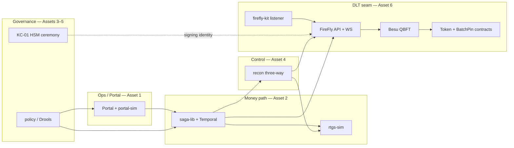

# DLT Demo Walkthrough — FireFly, Besu, Smart Contracts, Kaleido, Paladin

This guide explains how to **demonstrate the DLT integration seam** in the D-ETP day-one monorepo: what runs on EC2 today, what maps to **Kaleido-managed FireFly on Hyperledger Besu**, and where **Paladin** fits in the wider Garuda story.

---

## Architecture at a glance



| Layer | Dev (this repo) | Production |
|-------|-----------------|------------|
| FireFly REST/WS | `firefly-stub` :8092 | Kaleido-managed FireFly |
| Blockchain | Simulated (`QBFT_FINAL` in events) | **Hyperledger Besu** 4-validator QBFT |
| Smart contract | Hidden behind FireFly token API | FireFly-deployed **ERC-20 / BatchPin** on Besu |
| Signing | Stub accepts any mint | HSM key from **KC-01** ceremony |
| Paladin | **Not in Assets 1–6** | Confidential / privacy layer (separate phase) |

See also [`firefly-kit/PRODUCTION_DELTAS.md`](../firefly-kit/PRODUCTION_DELTAS.md).

---

## Mode A — EC2 / docker-compose (stub, recommended for demos)

No Besu node required. Demonstrates the **same Java integration code** and CLI scripts that production uses.

### Prerequisites

```bash
cd ~/day1-asset
docker compose up -d postgres redpanda temporal \
  policy saga-lib firefly-kit recon \
  rtgs-sim firefly-stub portal-sim
curl -sf http://localhost:8092/health && echo " firefly-stub OK"
curl -sf http://localhost:8087/actuator/health && echo " firefly-kit OK"
```

### Demo script (≈20 min)

| Step | Story | Command / UI |
|------|-------|--------------|
| 1 | Participant submits issuance | Portal → **Issuance** → Submit Rp 500M |
| 2 | FAFO queue + ISO 20022 | **FAFO Queue** → Load scripted day → click SETTLED row |
| 3 | Policy hot-reload | `make demo-limit-change` |
| 4 | RTGS + saga idempotency | `make demo-duplicate` → check portal **DUPLICATE_SUPPRESSED** |
| 5 | FireFly mint + WS replay | `make demo-replay` |
| 6 | IBM ↔ Kaleido contract | `make demo-contract-break` (Pact) |
| 7 | Three-way recon (RTGS = ledger = chain) | `make demo-break` → portal **Recon** |
| 8 | Signing identity ceremony | `make dry-run` + walkthrough [`ceremonies/runbooks/KC-01_key_generation.md`](../ceremonies/runbooks/KC-01_key_generation.md) |

### What to say about Besu / smart contracts (stub mode)

- Saga calls `POST /api/v1/tokens/mint` with **`idempotencyKey = UETR`** — same call in production.
- `firefly-kit` **ConfirmationListener** subscribes to `token_mint_confirmed` over WebSocket; offsets stored in PostgreSQL.
- Recon fetches **chain supply** via `GET /api/v1/tokens/wRD/supply` — in prod this reads finalized Besu state via FireFly.
- Smart contracts are **not invoked directly**; FireFly deploys and calls **BatchPin** + token contracts on Besu (see FireFly `ff init` output).

### Inspect stub directly

```bash
# Mint wRD (same API saga uses)
curl -sf -X POST http://localhost:8092/api/v1/tokens/mint \
  -H 'Content-Type: application/json' \
  -d '{"pool":"wRD","amount":"1000000","idempotencyKey":"demo-manual-001"}'

# Chain supply (recon reads this)
curl -sf http://localhost:8092/api/v1/tokens/wRD/supply

# Suppress next confirmation → triggers recon break demo
curl -sf -X POST http://localhost:8092/control/suppress-next-confirmation
```

---

## Mode B — Local or separate EC2: Hyperledger FireFly + Besu (`ff` CLI)

Runs a **real Besu node** and FireFly Supernode with deployed smart contracts.

| Where | Guide |
|-------|--------|
| Dev laptop | Steps below |
| **Second EC2 in same VPC** | [`deploy/aws/dlt-besu-ec2.md`](../deploy/aws/dlt-besu-ec2.md) (recommended for Jakarta demos) |

Requires **≥4 GB RAM** for Docker (8 GiB instance recommended).

### One-time setup

```bash
# Install FireFly CLI: https://github.com/hyperledger/firefly-cli
# macOS/Linux example:
go install github.com/hyperledger/firefly-cli/ff@latest

# Initialize Besu-backed stack (deploys BatchPin + token contracts)
./scripts/dlt-firefly-init.sh

# Start stack (first run pulls images; may take several minutes)
./scripts/dlt-firefly-start.sh
```

Default stack name: **`detp-besu`**. FireFly Core API is typically at **http://localhost:5000**.

### Wire day-one services to real FireFly

```bash
# Print export commands (local ff stack)
./scripts/dlt-firefly-wire.sh

# Remote host (second EC2 or Kaleido endpoint):
./scripts/dlt-wire-remote.sh 10.0.2.87
./scripts/dlt-wire-remote.sh 10.0.2.87 --apply   # EC2 A: stop stub + recreate services

# Or use compose overlay (FireFly on same host as Docker):
docker compose -f docker-compose.yml -f docker-compose.dlt.yml up -d saga-lib firefly-kit recon
```

Then re-run:

```bash
make demo-replay
make demo-break
```

### Verify on Besu

```bash
ff logs detp-besu --follow          # FireFly + Besu logs
curl -sf http://localhost:5000/api/v1/status | head
```

FireFly automatically deploys:

- **BatchPin** — batch anchoring contract
- **ERC-20 style token** — used for `wRD` pool operations via FireFly tokens API

You do not deploy Solidity manually unless extending with custom FFIs.

---

## Mode C — Kaleido production

1. Provision **Kaleido FireFly** on **Besu QBFT** (4 validators, BR-011).
2. Register **KC-01 public key** as FireFly signing identity (mTLS + operator cert).
3. Point env vars (same as Mode B wire script):

   | Service | Variable |
   |---------|----------|
   | saga-lib | `FIREFLY_URL`, `POLICY_URL` |
   | firefly-kit | `FIREFLY_URL`, `FIREFLY_WS_URL` |
   | recon | `RECON_FIREFLY_URL` |

4. Run the **same demos** (`demo-replay`, `demo-break`, saga duplicate) — behavior unchanged.
5. **Pact**: publish consumer contracts from `firefly-kit` CI; Kaleido runs provider verification (see `PRODUCTION_DELTAS.md`).

Differences from stub (must mention in stakeholder demos):

| Topic | Stub | Kaleido + Besu |
|-------|------|----------------|
| Finality | Immediate `finalized: true` | QBFT ≥ 2/3 validators (BR-012) |
| Transport | Plain HTTP/WS | mTLS |
| Signing | Open | HSM / ceremony key |
| Supply query | In-memory counter | On-chain finalized state |

### Kaleido cost (Besu + FireFly)

Kaleido bills **hourly per resource**; Besu uses the same **Ethereum node** meter as Geth/Quorum. FireFly is available on Kaleido BaaS networks; **FireFly Enterprise** (dedicated middleware) is **contact sales** on [kaleido.io/pricing](https://www.kaleido.io/pricing).

Official list prices (USD, check Kaleido for current rates):

| Plan | Membership | Besu / ETH node (small) | Storage | Typical use |
|------|------------|-------------------------|---------|-------------|
| **Starter** | $0 | **Free** (max 2 nodes) | Free | Sandbox only; auto-limited |
| **Developer** | $0 | **$0.15/hr** per node | $0.01 per 10 GB/hr | PoC / dev |
| **Business** | **$49/mo** | **$0.55/hr** (small); medium $0.70; large $0.85 | $0.01 per 10 GB/hr | Production-ish |
| **Enterprise** | Custom | Custom | Custom | Consortium, SOC2, multi-region |

**Example — D-ETP-style 4-validator QBFT (4 small nodes, 24×7):**

| Plan | Node compute | Membership | Storage (≈200 GB) | Support | **≈ Total / month** |
|------|--------------|------------|-------------------|---------|---------------------|
| Developer | 4 × $0.15 × 730 h = **$438** | $0 | ~$15 | $0 | **~$450** |
| Business | 4 × $0.55 × 730 h = **$1,606** | $49 | ~$15 | 7% Select ≈ $115 | **~$1,785** |

Kaleido's own **Business** example (1 node, not 4): ~**$462/mo** with membership + support ([pricing page](https://www.kaleido.io/pricing)).

**Compare to self-managed second EC2 (this repo):**

| Option | ≈ Monthly USD | Notes |
|--------|---------------|-------|
| EC2 B `t3.large` Jakarta | **~$65** + EBS | You operate Besu + `ff`; good for demos |
| EC2 B stopped when idle | **~$5** EBS only | App EC2 A can stay on stub |
| Kaleido Developer 4-node | **~$450** | Managed ops, no SSH |
| Kaleido Business 4-node | **~$1,800+** | Production support tier |
| Kaleido Enterprise / Asset Platform | **$10k+/mo** (Marketplace) | Regulated consortium; custom quote |

**When Kaleido is worth it:** multi-org consortium, compliance (SOC2/ISO), mTLS and identity out of the box, no validator patching, multi-region — not raw $/hour vs a single EC2.

**When EC2 B is enough:** integration testing, stakeholder demos, proving the same `FIREFLY_URL` seam before a Kaleido contract.

---

## Paladin

**Paladin is not implemented in this monorepo** (Assets 1–6). In a full Garuda/SATRIA architecture, Paladin typically provides **confidential token transfers** or private UTXO semantics **below or beside** the FireFly orchestration layer.

For day-one demos:

- Explain Paladin as a **future / parallel track** for privacy-preserving interbank flows.
- Show that the **FireFly REST/WS seam** (Asset 6) is the integration point IBM owns; Paladin would plug in via an additional FireFly connector or token provider configured in Kaleido — not via direct portal changes.

---

## Troubleshooting

| Symptom | Check |
|---------|--------|
| `make demo-replay` fails | `curl localhost:8092/health`; `docker compose ps firefly-stub` |
| Recon RED, 0 cases | API unreachable vs real break — see portal Recon error banner |
| `ff start` OOM | Add swap / use larger instance; Besu + FireFly need ~4 GB |
| Saga mint fails on real FF | Token pool `wRD` must exist on FireFly; check `FIREFLY_URL` |
| Linux `host.docker.internal` | Use `docker-compose.dlt.yml` (`extra_hosts: host-gateway`) |

---

## Quick reference

```bash
make demo-replay          # FireFly listener replay (Asset 6)
make demo-contract-break  # Pact / Kaleido CI story
make demo-duplicate       # Saga + RTGS dedup (Asset 2)
make demo-break           # Recon vs chain supply (Asset 4)
make dry-run              # HSM ceremony dry-run (Asset 5)
./scripts/dlt-firefly-init.sh   # Optional real Besu stack
./scripts/dlt-firefly-wire.sh   # Env vars for real FireFly
```
